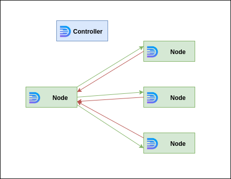

 
<br /><br /><br /><br /><br /><br />

Broadcasting illustration.

<br /><br /><br /><br /><br /><br />

It is possible to register callback with the same name on many nodes.

Let's consider we have the following callback registered on nodes with names `node-1`, `node-2` and `node-3`

```python
from daffi import Global, callback

proc_name = "node-<1, 2, 3>" # node-1, node-2 or node-3 depends on node

@callback
def my_callback(some_string: str) -> str:
    return some_string + "-" + proc_name


g = Global() # Connection via UNIX socket
g.join()
```


After that we can trigger broadcast remote call from node-4:

```python
from daffi import Global, BROADCAST, fetcher, __body_unknown__

proc_name = "node-4"

@fetcher
def my_callback(some_string: str) -> str:
    __body_unknown__(some_string)

    
g = Global(init_controller=True)

# Wait all processes to start
for proc in ("node-1", "node-2", "node-3"):
    g.wait_process(proc)

result = my_callback(some_string="abc") & BROADCAST(return_result=True)

print(result)
```

You should see the following output:

```json
{
"node-1":  "abc-node-1",
"node-2":  "abc-node-2",
"node-3":  "abc-node-3"
}
```

Where keys of dictionary are referred to node names where result was calculated and values represents calculated 
results respectively.  


One can also use g style callback execution instead of `fetcher`. For instance following statements have the same effect:

```python
result = g.call.my_callback(some_string="abc").broadcast(return_result=True)
```

or 

```python
result = g.call.my_callback(some_string="abc") & BROADCAST(return_result=True)
```