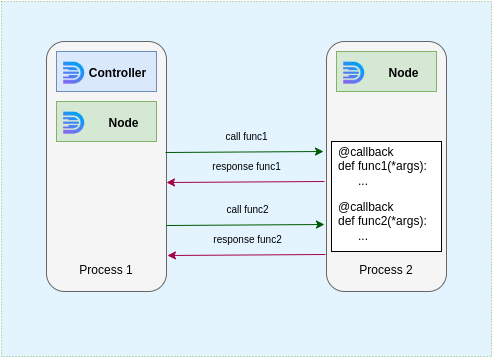
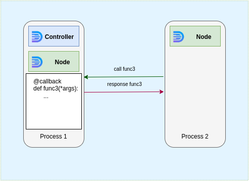

On the top level daffi has only 2 main components. It is [Global](code-reference/global.md) object and [callback](code-reference/callback.md) decorator

##### Global

[Global](code-reference/global.md) is the main initialization entrypoint and remote callbacks executor at the same time.

You can initialize [Global](code-reference/global.md) object using the following syntax:
```python
from daffi import Global
g = Global(process_name='my awersome process', init_controller=True, host='localhost', port=8888)
```
 
where:
 
`process_name` is optional `Node` identificator. 
 
!!! note
    If `process_name` argument is omitted then randomly generated name will be used.
    But in some cases it is helpful to give nodes meaningful names. 
    For example one process can wait another process by its name:
    
    ```python
    g.wait_process('process name here')
    ```

`init_controller=True` Means we want to start `Controller` in this process.

!!! note
    `init_node` argument is True
    by default so if you want to start only controller in particular process you should be explicit:


    ```python
    g = Global(process_name=process_name, init_controller=True, init_node=False, host='localhost', port=8888)
    ```

`host` and `port` arguments give `Controller` and `Node` information how to connect.


!!! note
    `host` and `port` arguments are also optional.
    For instance you can specify only `host`. In this case `Controller`/`Node` or both will be connected to random port

    You can also skip these two arguments:
    ```python
    g = Global(process_name=process_name, init_controller=True)
    ```
    In this case `Controller`/`Node` will be connected using UNIX socket. By default UNIX socket is created using path
    ```bash
    < temp directory >/daffi/.sock
    ```
    Where `< temp directory >` is temporary directory of machine where `Controller`/`Node` is running. For instance it is going to be `/tmp/daffi/.sock` on Ubuntu.


##### callback decorator

[callback](code-reference/callback.md) decorator registers function or class as remote callback. This way function (or all publicly available methods of decorated class) become visible for all nodes by its name.
[callback](code-reference/callback.md) decorator can register both synchronous and asynchronous functions/methods

```python
from daffi import callback

@callback
def sum_two_numbers(a: int, b: int) -> int:
    return a + b
```

in example above we registered callback with name `sum_two_numbers`.
Now it is possible to execute callback from remote process:

```python
from daffi import Global, FG

g = Global(process_name='my awersome process', init_controller=True, host='localhost', port=8888)

result = g.call.sum_two_numbers(10, 15) & FG
```

`FG` in this example is execution modifier. You can read about execution modifiers [here](execution-modifiers.md)
 
!!! warning
    Do not use the same callback names in different processes unless you want to use `BROADCAST` execution modifier.
    
    For singular execution, for instance if you have `sum_two_numbers` callback registered in process `A` and in process `B` then
    only one of them will be triggered. Daffi use random strategy to execute callback by name. You cannot control which one
    will be triggered.
    
!!! note
    If you decorated your function with a [callback](code-reference/callback.md) decorator, it doesn't mean that you can't call it locally like a regular function.
    Next example works fine locally:
    
    ```python
    from daffi import callback
    
    @callback
    def my_callback(a, b, c) -> int:
        print(a, b, c)
        
    my_callback(1, 2, 3)
    ```

!!! note
    instead of decorating functions you can create a decorated class:
    
    ```python
    @callback
    class RemoteCallbackGroup:
    
        def method1(self):
            ...
        
        def method2(self):
            ...
        
        @staticmethod
        def method3():
            ...
    ```   
    In this case all public methods of decorated class become remote callbacks (`public` means witout undersore in the beginning of name)
    
    !!! But be carefull. Not all methods of class are visible without class instance. Only `static` methods and `class` methods
    can be triggered without class initialization. For instance on example above only `method3` is remote callback by default.
    For all other methods to be registered you need to create instance of `RemoteCallbackGroup`
    
    Also it is worth to mention that such decorated classes are singletons. You cannot create more then one instance of class in application.
    It has simple explanation:
    
    In case of many registered methods with the same name it is not clear for daffi which one should be triggered.
 
    And last important point for classes:
    
    Do not decorate particular methods. Only class decoration is valid for classes!!!


### Full example

Lets create very simple apps based on classic one-to-one communication
where the `Controller` is running together with one of the nodes:


`Process 1` can trigger remote callbacks `func1` and `func2` from `Process2`. Communication between `Node` runinning in `Process1` and `Node` running in `Process2` is happen to be through `Controller` running in `Process1` 


 
<br /><br /><br /><br /><br /><br />
---
But if `func3` is registered as callback in `Process1` and `Process1` has `Node` running  this also means that `Process2` can call this callback at the same time.

<br /><br /><br /><br /><br /><br /><br /><br /><br />

---

Let's see the full example first, and we'll break it down piece by piece
<br /><br />

Process1:
```python
import time
import threading
from daffi import Global, callback, FG, NO_RETURN


@callback
def func3(a: int, b: int) -> int:
    """Add 2 numbers and return sum"""
    # Simulate long running job
    time.sleep(3)
    return a + b


def remote_process_executor(g: Global):
    """Execute remote callbacks"""

    for _ in range(10):
        delta = g.call.func1(10, 3) & FG

        print(f'Calculated delta = {delta}')

        g.call.func2() & NO_RETURN

        time.sleep(5)


def main():
    """Main entrypoint"""
    process_name = 'proc1'

    g = Global(process_name=process_name, init_controller=True, host='localhost', port=8888)

    g.wait_process('proc2')

    re = threading.Thread(target=remote_process_executor, args=(g,))
    re.start()
    re.join()

    g.stop()


if __name__ == '__main__':
   main()
```
(This script is complete, it should run "as is")


Process2:
```python
"""Lets make process 2 asynchronous! Daffi works great with any type of applications"""
import asyncio
from daffi import Global, callback, BG


@callback
async def func1(a: int, b: int) -> int:
    """Subtracts 2 numbers and return delta"""
    return a - b


@callback
def func2() -> None:
    """Just print text to console"""
    print('Func2 has been triggered!')


async def remote_process_executor(g: Global):
    """Execute remote callbacks"""
    for _ in range(5):
        future = g.call.func3(4, 6) & BG

        # Do smth while result is processing
        await asyncio.sleep(2)

        # Get result
        result = await future.get_async()
        print(f"Calculated sum is {result!r}")


async def main():
    """Main entrypoint"""

    process_name = 'proc2'

    g = Global(process_name=process_name, host='localhost', port=8888)
    asyncio.create_task(remote_process_executor(g))

    # Wait forever
    await g.join_async()


if __name__ == '__main__':
   asyncio.run(main())
```
(This script is complete, it should run "as is")


### Explanation

In `Process1` we initialize [Global](code-reference/global.md) object to use TCP connection and init controller in this process.
```python
g = Global(process_name=process_name, init_controller=True, host='localhost', port=8888)
```
Then we start `remote_process_executor` function in separate thread and wait this thread to be complete.
```python
re = threading.Thread(target=remote_process_executor, args=(g,))
re.start()
re.join()
```

`remote_process_executor` call `func1` and `fund2` callbacks of `Process2` 10 times. For one of them it uses execution modifier `FG` to take result
and for second use modifier `NO_RETURN` to skip result.
```python
for _ in range(10):
    delta = g.call.func1(10, 3) & FG

    print(f'Calculated delta = {delta}')

    g.call.func2() & NO_RETURN

    time.sleep(5)
```

And last step we stop [Global](code-reference/global.md) connection:
```python
g.stop()
```

`stop` method make sense only for short living applications like periodic jobs etc. 
For long running applications you can use `g.join()` or `g.join_async()` if you have async application.


In contrast to `Process1`, `Process2` script use asyncio. Daffi can work with async code as well.

[Global](code-reference/global.md) instance initialization looks like this:

```python
g = Global(process_name=process_name, host='localhost', port=8888)
```

If `init_controller=True` argument is skipped then only `Node` will be initialized in current process.
Also `Process2` sleeps forever on next line: 

```python
await g.join_async()
```

To know more about async daffi capabilities you should check this [section](async-apps.md)


### Another examples

You can check another examples at: [https://github.com/600apples/dafi/tree/main/examples](https://github.com/600apples/dafi/tree/main/examples)
