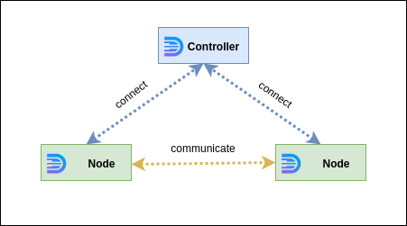
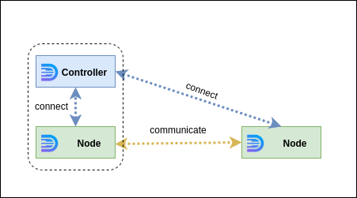

## Controller
In daffi terminology server is called `Controller`.

The `Controller` behaves as a broker and cannot call remote callbacks on its own.
`Controller` can be run in any of the processes where remote callbacks are registered, 
but it can also work as stand-alone application. Both variants are fine depends on your requirements.
Usually application infrastructure includes only one `Controller` but it is possible to have several 
if you want to create several isolated systems.

## Node
`Node` is client that is running along with `Controller` or as stand-alone process.

The application where the `Node` is running gets the opportunity to register callbacks and call the callbacks of other nodes.
All serialization/deserialization process, remote callbacks executions etc is the `Node`'s responsibility.

### Typical architecture

A typical application architecture consists of one controller and two or more nodes.
The controller can work as a standard application or share the process with a node:

 
   
Stand alone `Controller`.

This architecture is suitable where there are more than 2 nodes and complex inter-node communication is expected.
  

 
  
`Controller` shares process with one of nodes.

This architecture is suitable for simple node-to-node requests or streams.
But also can be considered as solution when one of the processes is the leader with the ability to give commands to all other nodes
     

!!! warning
    Again. `Controller` is just broker for inter-node communication.

    If you want to initialize controller with the ability to make remote requests,
    you need to consider latter solution (`Controller shares process with one of nodes`)