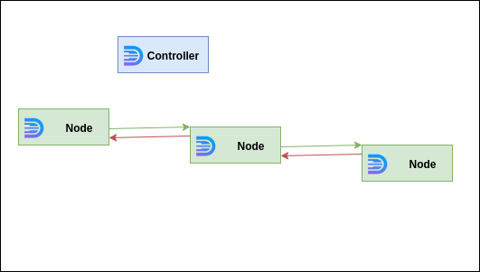

 
<br /><br /><br /><br />

Pipeline illustration.

<br /><br /><br /><br /><br /><br />

It is possible to trigger chain of callbacks where one callback takes result from another and returns this result to caller.

For this feature there is special ability of daffi we didn't mentioned before:

One can create and register callback that takes special argument `g` (You can read more about [g object injection](g-object-injection.md))


process `node-1`:
```python
from daffi import callback, Global, FG

@callback
def pipeline_cb1(g: Global):
    res = g.call.pipeline_cb2() & FG
    return res
```

Following this example lets consider we have `pipeline_cb2` registered on `node-2` and `pipeline_cb3` registered on `node-3`


process `node-2`:
```python
from daffi import callback, Global, FG

@callback
def pipeline_cb2(g: Global):
    res = g.call.pipeline_cb3() & FG
    return res
```

process `node-3`:
```python
from daffi import callback

@callback
def pipeline_cb3():
    return "my secret sting"
```


So if we execute `pipeline_cb1` from separate process:

```python
from daffi import Global, FG

proc_name = "node-4"


g = Global(init_controller=True)

# Wait all processes to start
for proc in ("node-1", "node-2", "node-3"):
    g.wait_process(proc)

result = g.call.pipeline_cb1() & FG

print(result)
```

we got "my secret sting" as the result of execution but not directly from `pipeline_cb1`.
Full chain is `pipeline_cb1` -> `pipeline_cb2` -> `pipeline_cb3`
